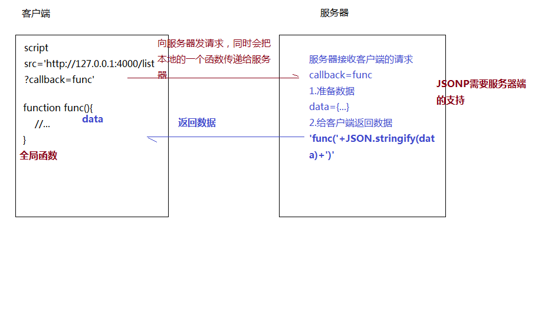

# 前端跨域解决方案(11种方案详细笔记)
## 一、跨域问题的产生及其价值意义
跨域（非同源策略请求），是由浏览器的安全机制引起的。
三者都一样就是同源，只要有一个不同就是跨域
- 协议
- 域名
- 端口号
  <br>WEB服务器地址：http://127.0.0.1:3000/index.html<br>
 数据接口地址：http://127.0.0.1:4000/list
### 前端（跨域）的发展：
1、没有专门的前端，由后端一起做。<br>
2、前后端分开，部署的时候部署在同一个服务器，这样就不存在跨域问题。但是，开发的时候前后端是分开的，还是会存在跨域，怎么办呢？有的公司要求前端也用idea进行开发，也就是前端代码外面包一层java或其它后端代码，运行的时候也要运行后端服务，这样的做法给前端开发加大了难度。

- 同源策略请求  ajax / fetch
- 跨域传输 

部署到web服务器上：同源策略

- xampp  修改本地的host文件 

```
127.0.0.1:1234  http://api.qq.com/
```

http://127.0.0.1:1234/index.html
http://api.qq.com/getData
<br>
3、前后端完全分离，分开开发，分开部署web服务器，data服务器，图片服务器。 第三方开源的数据接口也会引起跨域（这样的情况非常多）。
## 二、JSONP跨域解决方案的底层原理
- script
- img
- link
- iframe
- ...
  =>不存在跨域请求的限制
```
<script src="https://cdn.bootcss.com/jquery/3.4.1/core.js"></script>
// 这个就是因为script标签没有跨域限制，所以才能成功请求加载。
```
JSONP核心原理图：

react中子组件想要修改父组件中的状态，也是传递一个回调函数给父组件，这个思想和JSONP的思想是一致的。

* JSONP需要服务器端的支持

* 问题：JSONP只能处理GET请求（放在'？'后面不安全，服务器返回的数据在浏览器会直接执行，如果是木马修改的呢？也会直接执行，不安全）
### 举例：

* html页面：1.jsonp.html

```html
<!DOCTYPE html>
<html>

<head>
  <meta charset="UTF-8">
  <meta http-equiv="X-UA-Compatible" content="ie=edge">
  <meta name="viewport" content="width=device-width, user-scalable=no, initial-scale=1.0">
</head>

<body>
  <script src="https://cdn.bootcss.com/jquery/3.4.1/jquery.min.js"></script>
  <script src="./1.jsonp.js"></script>
</body>

</html>
```

* 1.jsonp.js

```
$.ajax({
	url: 'http://127.0.0.1:8001/list',
	method: 'get',
	dataType: 'jsonp', //=>执行的是JSONP的请求,这是jquery封装的ajax的功能
	success: res => {
		console.log(res);
	}
});
```

* 服务端配合：serverJSONP.js:

```
let express = require('express'),
	app = express();
app.listen(8001, _ => { // 监听8001端口
	console.log('OK!');
});
app.get('/list', (req, res) => {
	let {
		callback = Function.prototype // callback如果没有，默认为空的函数
	} = req.query;
	let data = {
		code: 0,
		message: '返回jsonp请求的结果'
	};
	res.send(`${callback}(${JSON.stringify(data)})`); //=>后端需要处理好这样的数据格式
});
```
## 三、CORS跨域资源共享
**客户端正常发送请求，服务端设置相关的头信息。**
* 客户端（发送ajax/fetch请求）
```
axios.defaults.baseURL = 'http://127.0.0.1:8888';
axios.defaults.withCredentials = true;
axios.defaults.headers['Content-Type'] = 'application/x-www-form-urlencoded';
axios.defaults.transformRequest = function (data) {
  if (!data) return data;
  let result = ``;
  for (let attr in data) {
    if (!data.hasOwnProperty(attr)) break;
    result += `&${attr}=${data[attr]}`;
  }
  return result.substring(1);
};
axios.interceptors.response.use(function onFulfilled(response) {
  return response.data;
}, function onRejected(reason) {
  return Promise.reject(reason);
});
axios.defaults.validateStatus = function (status) {
  return /^(2|3)\d{2}$/.test(status);
}
```

* 服务器端设置相关的头信息（需要处理options试探性请求）
```
app.use((req, res, next) => {
    res.header("Access-Control-Allow-Origin", "http://localhost:8000"); // http://localhost:8000是允许跨域请求的地址，如果允许很多地址跨域请求，设置为"*"
	//=>*（就不能在允许携带cookie了） 具体地址
    res.header("Access-Control-Allow-Credentials", true);
    res.header("Access-Control-Allow-Headers", "Content-Type,Content-Length,Authorization, Accept,X-Requested-With");
    res.header("Access-Control-Allow-Methods", "PUT,POST,GET,DELETE,HEAD,OPTIONS");
    if (req.method === 'OPTIONS') {
        res.send('OK!');
        return;
    }
    next();
});
```
## 四、基于`http proxy`实现跨域请求
```
http proxy  =>webpack webpack-dev-server
```
修改`webpack.config.js`
```
let path = require('path');
let HtmlWebpackPlugin = require('html-webpack-plugin');
module.exports = {
	mode: 'production',
	entry: './src/index.js',
	output: {
		filename: 'bundle.min.js',
		path: path.resolve(__dirname, 'build')
	},
	devServer: {
		port: 3000,
		progress: true,
		contentBase: './build',
		proxy: { // => 以'/'开始的请求，就把请求路径转到 target
			'/': {
				target: 'http://127.0.0.1:3001',
				changeOrigin: true // => 允许跨域
			}
		}
	},
	plugins: [
		new HtmlWebpackPlugin({
			template: './src/index.html',
			filename: 'index.html'
		})
	]
};
```
## 五、基于`post message`实现跨域处理
https://developer.mozilla.org/zh-CN/docs/Web/API/Window/postMessage

A页面
```
<iframe src="http://www.github.com/B.html"></iframe>
<script>
    let iframe = document.querySelector('iframe');
    iframe.onload = function () {
        iframe.contentWindow.postMessage('github', 'http://www.github.com/');
    }
    window.onmessage = function (ev) {
        console.log(ev.data);
    }
</script>
```

B页面
```
window.onmessage = function (ev) {
    console.log(ev.data);
    ev.source.postMessage(ev.data+'@@', ev.origin);
}
```
## 六、`ngnix`反向代理 =>不需要前端做什么
www.github.cn -> www.github.com
```
#proxy服务器
server {
    listen       80;
    server_name  www.github.com;
    location / {
        proxy_pass   www.github.cn; #反向代理
        proxy_cookie_demo www.github.cn www.github.com;
        add_header Access-Control-Allow-Origin www.github.cn;
        add_header Access-Control-Allow-Credentials true;
    }
}
```
## 七、基于`iframe`的跨域解决方案：
### 	`window.name / document.domin / location.hash`
### window.name + iframe
页面A
```
let proxy = function(url, callback) {
    let count = 0;
    let iframe = document.createElement('iframe');
    iframe.src = url;
    iframe.onload = function() {
        if(count===0){
          iframe.contentWindow.location = 'http://www.github.cn/proxy.html';
          count++;
          return;
        }
        callback(iframe.contentWindow.name);
    };
    document.body.appendChild(iframe);
};

//请求跨域B页面数据
proxy('http://www.github.cn/B.html', function(data){
    alert(data);
});
```

B页面
```
window.name = 'github';
```

proxy.html是空页面

### location.hash + iframe
A和C同源
A和B非同源

页面A
```
<iframe id="iframe" src="http://127.0.0.1:1002/B.html" style="display:none;"></iframe>
<script>
    let iframe = document.getElementById('iframe');
    //=>向B.html传hash值
    iframe.onload=function(){
       iframe.src = 'http://127.0.0.1:1002/B.html#msg=github';
    }
    
    //=>开放给同域C.html的回调方法
    function func(res) {
        alert(res);
    }
</script>
```

页面B
```
<iframe id="iframe" src="http://127.0.0.1:1001/C.html" style="display:none;"></iframe>
<script>
    let iframe = document.getElementById('iframe');
    //=>监听A传来的HASH值改变，再传给C.html
    window.onhashchange = function () {
        iframe.src = "http://127.0.0.1:1001/C.html"+ location.hash;
    }
</script>
```

页面C
```
<script>
    //=>监听B传来的HASH值
    window.onhashchange = function () {
        //=>再通过操作同域A的js回调，将结果传回
        window.parent.parent.func(location.hash);
    };
</script>
```

### document.domain + iframe
只能实现：同一个主域，不同子域之间的操作<br>
v.qq.com<br>
sports.qq.com

父页面A  http://www.github.cn/A.html
```
<iframe src="http://school.github.cn/B.html"></iframe>
<script>
    document.domain = 'github.cn';
    var user = 'admin';
</script>
```
子页面B  http://school.github.cn/B.html
```
<script>
    document.domain = 'github.cn';
    alert(window.parent.user);
</script>
```
## 八、WebSocket协议跨域
前端处理
```
<script src="./socket.io.js"></script>
<script>
let socket = io('http://127.0.0.1:3001/');
//=>连接成功处理
socket.on('connect', function() {
    //=>监听服务端消息
    socket.on('message', function(msg) {
        console.log('data from server:' + msg); 
    });
    //=>监听服务端关闭
    socket.on('disconnect', function() { 
        console.log('server socket has closed!');
    });
});
//=>发送消息给服务器端
socket.send("github");
</script>
```

服务器端处理
```
//=>监听socket连接：server是服务器创建的服务
socket.listen(server).on('connection', function(client) {
    //=>接收信息
    client.on('message', function(msg) {
        //=>msg客户端传递的信息
        //...
        client.send(msg+'@@');
    });
    //=>断开处理
    client.on('disconnect', function() {
        console.log('client socket has closed!');
    });
});
```

